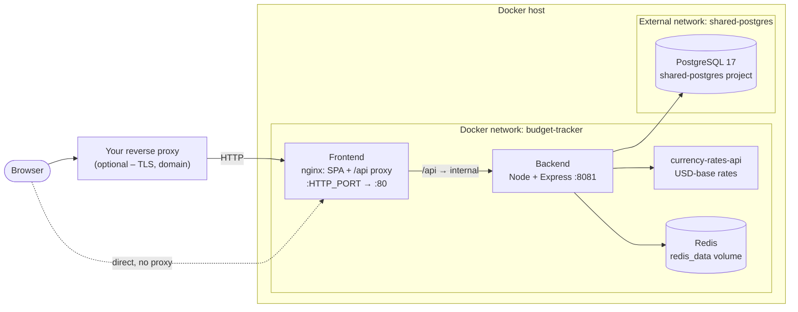

# Setup Guide

Run Budget Tracker on your own server. The stack pulls published multi-arch
images and exposes the whole app on **one host port**. You put whatever reverse
proxy you already run in front of it – Nginx Proxy Manager, npmplus, Caddy,
Traefik, or nothing at all for a LAN / localhost trial. A bundled Traefik
overlay is available if you'd rather the stack terminate TLS itself.

This guide assumes:

- A host with Docker Engine + the Compose plugin (a fresh Ubuntu 22.04 / 24.04
  or Debian 12 VPS is the common case, but any Docker host works).
- 2 GB RAM minimum. The pull-based path is light; only the optional
  build-from-source overlay is memory-heavy.

The stack is: the **frontend** (nginx serving the SPA and reverse-proxying
`/api` to the backend), the **backend** (Node + Express), an independently managed **Postgres** server for
storage, **Redis** for queues, and the `currency-rates-api` sidecar for
exchange-rate data. No external API keys are required for core functionality.

## What you get



The frontend container is the single public entrypoint. It serves the SPA and
proxies `/api/` to the backend over the internal `budget-tracker` network, so the
browser only ever talks to **one origin** – app and API are same-origin, and
there is no CORS to configure. Only the frontend's host port
(`${HTTP_PORT:-8080}`) is published by this stack. PostgreSQL is reached over the
external shared network; its separate infrastructure publishes a loopback-only admin port.

> **Architecture**: the frontend, backend, and redis images are
> multi-arch and run natively on both `amd64` and `arm64` hosts (Hetzner ARM,
> Oracle Ampere, AWS Graviton). The `currency-rates-api` sidecar is currently
> published as `amd64` only, so on an `arm64` host Docker runs it under QEMU
> emulation – functional but slower at rate-sync time.

## Table of Contents

1. [Prerequisites](#1-prerequisites)
2. [Quickstart](#2-quickstart)
3. [Behind your own reverse proxy](#3-behind-your-own-reverse-proxy)
4. [Optional: build from source](#4-optional-build-from-source)
5. [Backups](#5-backups)
6. [Updating](#6-updating)

Reference docs: [reverse proxies](reverse-proxies.md) ·
[Traefik overlay](traefik-overlay.md) ·
[environment variables](environment-reference.md) ·
[troubleshooting](troubleshooting.md)

---

## 1. Prerequisites

Start shared-postgres and provision a database first; follow the
[external PostgreSQL setup and migration guide](external-postgres.md).

Docker Engine with the Compose plugin must be installed — see the
[official install guide](https://docs.docker.com/engine/install/) for your
platform. Verify with:

```bash
docker --version
docker compose version
```

## 2. Quickstart

You need two things on the host: the compose file(s) and a filled-in `.env`,
side by side. Cloning the repo is the simplest way to get them, but for the
pull-based path you can also just download the `self-hosting/` folder on its
own – it is self-contained: the compose file, the overlays, and your `.env` all
live in it, and the backend reads `.env` from that same directory. (Building
from source still needs the full repo checkout.)

```bash
git clone https://github.com/letehaha/budget-tracker.git
cd budget-tracker/self-hosting
cp .env.example .env
```

Open `.env` and fill the **REQUIRED** section. The minimum to boot:

```bash
NODE_ENV=production

# The URL you open the app at in the browser. The default works for a
# localhost trial as-is; for a real deployment set your public URL
# (e.g. https://budget.example.com – it serves both the app and /api).
BETTER_AUTH_URL=http://localhost:8080
AUTH_ORIGIN=http://localhost:8080

# Auth secrets – generate three fresh, distinct values.
# Use `openssl rand -base64 32` to generate values.
APPLICATION_JWT_SECRET=<paste output of: openssl rand -base64 32>
APP_SESSION_ID_SECRET=<paste output of: openssl rand -base64 32>
BETTER_AUTH_SECRET=<paste output of: openssl rand -base64 32>

# Database password (the other DB_* values already have sane defaults).
APPLICATION_DB_PASSWORD=<paste output of: openssl rand -base64 32>
```

> The backend refuses to start while any of `APPLICATION_JWT_SECRET`,
> `APP_SESSION_ID_SECRET`, `BETTER_AUTH_SECRET`, or `APPLICATION_DB_PASSWORD`
> is still `__REPLACE_ME__`.

> **`BETTER_AUTH_URL` and `AUTH_ORIGIN` always carry the same value** – the
> URL a browser uses to reach the app. The API is served under `/api/v1` on
> that same origin, so there is no separate API URL to configure. When you
> later put the app behind a domain, update both to that URL and restart.

Start the stack from the `self-hosting/` folder:

```bash
docker compose up -d
```

This pulls the published images (`letehaha/budget-tracker-fe`,
`letehaha/budget-tracker-be`, `letehaha/currency-rates-api`,
`redis:7`) and starts everything. The backend runs database migrations on boot
before it starts serving, so its healthcheck stays red for the first
30–60 seconds – that's expected.

Watch the logs:

```bash
docker compose logs -f
```

Then open the app on the published port:

```
http://<host>:8080
```

Set `HTTP_PORT` in `.env` to publish on a different port. On a
laptop this is a complete localhost trial – no domain, no TLS, no reverse
proxy needed. For a public deployment, put a reverse proxy in front (next
section).

> **Keep `.env` on the host, not in an image.** Compose auto-loads it as
> `./.env` beside the compose file – for interpolation into the frontend
> `environment:` block and the compose-level settings, and via `env_file:` for
> the backend container's runtime env. It is never copied into any image, so DB
> password and auth secrets stay out of pushed image layers. Do **not** commit
> it to git.

## 3. Behind your own reverse proxy

This is for when you have a domain (say `budget.example.com`) and already run
a reverse proxy – Nginx Proxy Manager, Caddy, Traefik, plain nginx – that
handles HTTPS for your services. Three steps:

**Step 1 – point the proxy at the app.** In your proxy, forward
`budget.example.com` to `http://<server>:8080` (or whatever `HTTP_PORT` you
chose). Per-proxy instructions are in [reverse-proxies.md](reverse-proxies.md).

**Step 2 – tell the app its public address.** In `.env`, set both values to
the URL people will actually type in the browser:

```bash
BETTER_AUTH_URL=https://budget.example.com
AUTH_ORIGIN=https://budget.example.com
```

Then run `docker compose up -d` again. Skipping this step is the #1 cause of
"login doesn't work" – the app only accepts logins coming from this exact URL.

**Step 3 – close the direct port.** Setting up the proxy doesn't switch off
the original port: the app is still reachable by anyone at
`http://<server-ip>:8080`. You don't want that – traffic there is unencrypted,
and logins there fail anyway (wrong URL, see step 2), which looks like a
confusing login loop. How to close it depends on where your proxy runs:

- **Proxy on the same server as the app** (the usual case): in `.env`, change

  ```bash
  HTTP_PORT=8080
  ```

  to

  ```bash
  HTTP_PORT=127.0.0.1:8080
  ```

  and run `docker compose up -d` again. The `127.0.0.1:` prefix means "only
  reachable from this machine": your proxy still reaches the app at
  `http://127.0.0.1:8080`, but from the internet the port looks closed.

- **Proxy runs in Docker on the same server** (Nginx Proxy Manager, a
  dockerized Caddy or Traefik): the `127.0.0.1:8080` change alone breaks the
  proxy – inside the proxy container, `127.0.0.1` is the container itself, not
  the host, so it can't reach the app there. First switch the proxy to reach the
  app over the Docker network, then the `127.0.0.1:8080` setting above is safe to
  apply. Full steps:
  [reverse-proxies.md](reverse-proxies.md#proxy-running-in-docker-on-the-same-server).

- **Proxy on a different machine:** the `127.0.0.1:` trick won't work (the
  proxy needs to reach the app over the network), so block port 8080 in your
  hosting provider's firewall instead – the firewall panel at Hetzner /
  DigitalOcean / AWS / etc. – allowing only your proxy machine's IP. Careful:
  a firewall running on the server itself (like `ufw`) will **not** block
  this port – Docker opens published ports underneath it.

No reverse proxy yet? The stack can handle HTTPS itself with the bundled
Traefik overlay – see [traefik-overlay.md](traefik-overlay.md).

## 4. Optional: build from source

Contributors and forks can build the images locally instead of pulling them.
Add the build overlay and pass `--build`:

```bash
docker compose -f docker-compose.yml \
  -f docker-compose.build.yml up -d --build
```

Runtime configuration is unchanged – the frontend is still configured through
the `environment:` block and the backend through `env_file:`. The build args
only feed build-time concerns (e.g. Sentry source-map upload) and are all
optional; see the **BUILD-FROM-SOURCE ONLY** section of
`.env.example`. This path is memory-heavy: if the frontend build
OOMs, add 2 GB of swap (see [troubleshooting.md](troubleshooting.md)).

## 5. Backups

PostgreSQL storage and backups are owned by shared-postgres. From that checkout:

```sh
python3 scripts/backup.py budget_tracker /absolute/path/backup.dump
python3 scripts/provision.py budget_tracker_restored budget_tracker_restored
python3 scripts/restore.py budget_tracker_restored budget_tracker_restored /absolute/path/backup.dump
```

Restore targets must be empty. See [migration and rollback](external-postgres.md)
for existing volumes and legacy SQL backups.

## 6. Updating

The stack tracks the `latest` image tag, and `up -d` alone never re-pulls a
tag Docker has already cached — so updating is a two-step:

```bash
docker compose pull
docker compose up -d
```

Compose recreates only the containers whose image changed. The backend runs
any new database migrations on boot, so its healthcheck stays red for a
minute, same as on first start. Take a [backup](#5-backups) before updating.

To pin the stack to an exact build instead of following `latest`, set
`IMAGE_TAG=sha-<commit>` in `.env` (every published image is also tagged with
its commit SHA). A pinned stack only updates when you change the pin.

---

## Troubleshooting

Common issues – `502` from `/api`, backend boot failures, CSP errors,
Let's Encrypt problems, and more – are covered in
[troubleshooting.md](troubleshooting.md).

---

## NOTES

- **Same-origin by default.** The frontend proxies `/api` to the backend
  internally, so app and API share one origin and there is no CORS to manage.
  A separate API origin (`API_HTTP` + split-domain Traefik) remains possible
  but is opt-in.
- **The stack knows it is self-hosted.** `docker-compose.yml` marks both
  containers as a self-hosted install, with nothing for you to configure. Two
  things follow from it: a custom AI endpoint may point at a model server on
  your own network (the hosted service only allows public addresses), and
  restoring a backup fetches your stocks' and crypto's past prices again so
  charts cover their full history. See
  [environment-reference.md](environment-reference.md#set-for-you).
- **Runtime-configurable frontend image.** The published frontend image reads
  its config from env at container start (writing `window.__APP_CONFIG__` and
  rendering the CSP), so analytics keys, API target, and CSP hosts change with
  a restart – no rebuild. `VITE_SENTRY_RELEASE` is the one deployment value
  baked in, because it names the source maps uploaded for that exact bundle;
  changing it meaningfully requires a rebuild.
